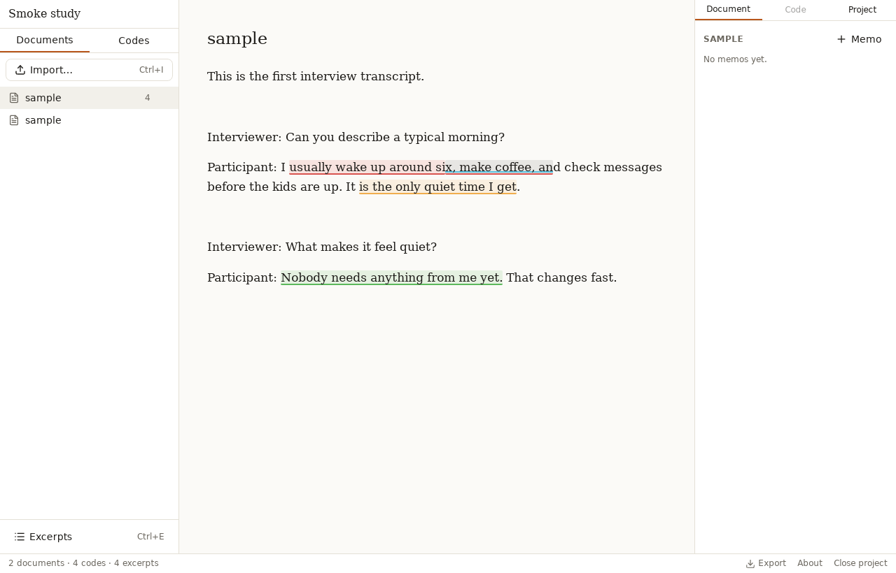
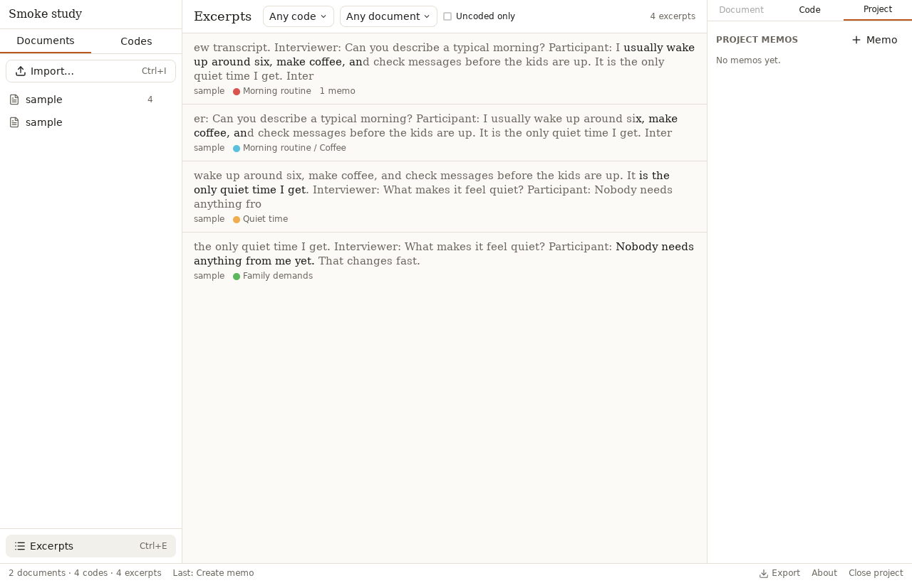

# Misket

Open-source qualitative coding for text, with images and video on the way.
Misket is a local-first desktop app: your project is a single file on your
machine, and nothing is uploaded anywhere.

It is an alternative to tools like Dedoose for researchers who want a modern,
keyboard-friendly interface without a subscription.



## What it does today (milestone 1)

- **Import** plain text, Markdown, Word (`.docx`) and PDF (text only) documents.
- **Build a codebook**: nested codes with colors, descriptions, single-key
  hotkeys, drag-and-drop reordering, merge and delete with impact preview.
- **Code excerpts**: select text, press `Ctrl`/`⌘`+`K` and pick a code (type
  `>name` to create one on the spot), or press a code's hotkey. Overlapping
  excerpts are drawn as stacked colored lanes.
- **Browse excerpts** across the project, filtered by code (with sub-codes),
  document, or uncoded only, and jump back to any of them in context.
- **Memos** on documents, codes, excerpts and the project.
- **Undo/redo** for every coding and codebook action.
- **Export** the codebook and excerpts as CSV, or the whole project as JSON.



## Keyboard

| Action                                                 | Shortcut                                      |
| ------------------------------------------------------ | --------------------------------------------- |
| Code the selection / add a code to the focused excerpt | `Ctrl`/`⌘` + `K`                              |
| Apply a code directly                                  | its hotkey (set in the code's settings)       |
| Next / previous excerpt                                | `Tab` / `Shift`+`Tab`                         |
| Edit the focused excerpt                               | `Enter`                                       |
| Delete the focused excerpt                             | `Backspace`                                   |
| New memo on the current document, code or excerpt      | `Ctrl`/`⌘` + `M`                              |
| Excerpt browser                                        | `Ctrl`/`⌘` + `E`                              |
| Find in the current document                           | `Ctrl`/`⌘` + `F`                              |
| Find in project (search every document)                | `Shift` + `Ctrl`/`⌘` + `F`                    |
| Import documents                                       | `Ctrl`/`⌘` + `I`                              |
| Undo / redo                                            | `Ctrl`/`⌘` + `Z` / `Shift` + `Ctrl`/`⌘` + `Z` |

## Install

Builds for macOS, Windows and Linux are published on the
[releases page](https://github.com/izgebayyurt/misket/releases). They are not
code-signed yet: macOS will ask you to allow the app under System Settings >
Privacy & Security, and Windows SmartScreen will show a warning the first time.

Your project is a `.misket` file (a SQLite database). Back it up like any other
file.

## Development

Prerequisites: Node 22, pnpm 10, Rust stable, and the
[Tauri prerequisites](https://tauri.app/start/prerequisites/) for your OS.

```sh
pnpm install
pnpm tauri dev          # run the app with hot reload
pnpm check              # lint + typecheck + vitest
cargo test --workspace  # database and domain logic tests
pnpm tauri build        # installable bundle for this platform
```

### Setting up on macOS from scratch

Minimums: Rust 1.85 or newer (some dependencies use the 2024 edition) and
Node 22. Use rustup for Rust and a version manager such as nvm for Node; the
Homebrew `rust` and `node@22` packages are easy to end up with stale or
mismatched libraries.

```sh
xcode-select --install                                   # compilers and system SDKs
curl --proto '=https' --tlsv1.2 -sSf https://sh.rustup.rs | sh   # Rust stable (or: rustup update stable)
brew install nvm && nvm install 22                       # Node 22 (follow nvm's shell-setup notes first)
corepack enable && corepack prepare pnpm@10.33.0 --activate      # pnpm, pinned by package.json
git clone https://github.com/izgebayyurt/misket.git ~/Documents/GitHub/misket
cd ~/Documents/GitHub/misket
pnpm install
pnpm tauri dev
```

The first `pnpm tauri dev` compiles the Rust side and takes a few minutes; later
runs are incremental.

See [docs/ARCHITECTURE.md](docs/ARCHITECTURE.md) for how the pieces fit
together, [docs/DATA_MODEL.md](docs/DATA_MODEL.md) for the schema, and
[e2e/README.md](e2e/README.md) for the WebDriver smoke test.

## Roadmap

- **Milestone 2**: coding image regions and video time ranges (the data model
  already supports both).
- Descriptors for mixed-methods work, inter-rater reliability, full-text
  search, REFI-QDA import/export, project sharing.

## License

MIT
